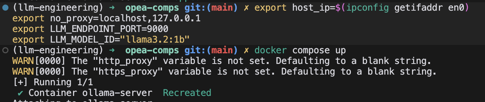
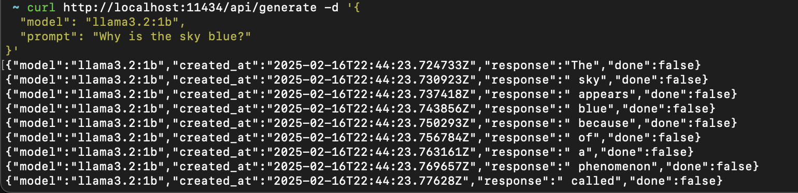
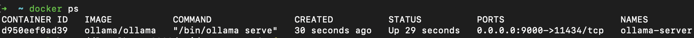
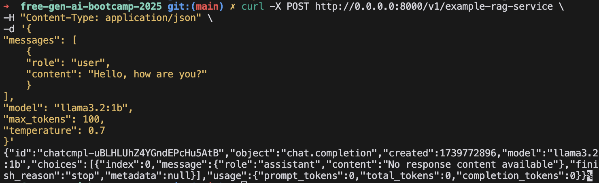
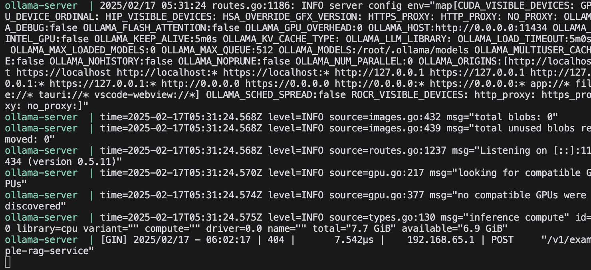
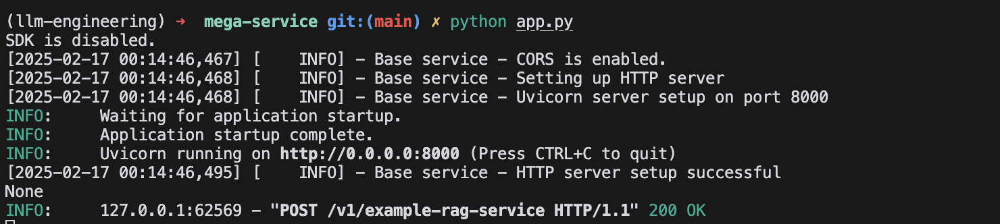

# Running OPEA on local machine - Mac OS M1 Pro

**Description:**
Running Ollama third-party service container locally with docker.


### Installation Requirements
- Docker
    - run `docker` to test that docker is installed. 
- Ollama
    Start ollama server on your machine after intalling it.
    Fetch the ollama model you want to use.
    - `ollama pull <model>`
    - `ollama pull llama3.2:1b`

You can get the model id string of the model you want to usefrom the ollama website:
https://ollama.com/library/llama3.2:1b

**Running Ollama:**
All of your local models are automatically served on localhost:11434. 
You run ollama run <name-of-model> to start interacting via the command line directly. To ensure everything is working:
`ollama run llama3.2:1b` 


### Project Setup
Create a `docker-compose.yaml` file and copy over the contents from the ollam documentation. We will not use a proxy. see: `docker-compose.yaml` for details.

Ollama-docker opea documentation (docker-compose.yaml file)
https://github.com/opea-project/GenAIComps/tree/main/comps/third_parties/ollama

- Installed the docker extension in cursor. 

You will need to get your IP address to use in the `docker-compose.yaml` file. This will vary depending on your operating system.

For macOS, use:
```bash
host_ip=$(ipconfig getifaddr en0)
```

For Linux systems, use: (this will throw an error on macos)
```bash
host_ip=$(hostname -I | awk '{print $1}') 
```

### Environment Setup and Running Docker Container

You have to make sure that you export the environment variables before running the docker compose up command. This will set your environment variables and then build the docker container.

This will take a bit of time the first time you run it. If you misconfigure the environment variables, you can stop the docker container and export them. then run docker compose up again.

```bash
# For macOS
export host_ip=$(ipconfig getifaddr en0)
export no_proxy=localhost,127.0.0.1
export LLM_ENDPOINT_PORT=9000 
export LLM_MODEL_ID="llama3.2:1b" 
docker compose up
```

This shows the successful build of the docker container and that the environment variables are set.



You can use: `docker ps` to see what docker containers are running, in another terminal. 


### Ollama API 
- [Ollama API Docs](https://github.com/ollama/ollama/blob/main/docs/api.md)
- Once the Ollama server is running, we can make API calls to the Ollama API.
- Generate a completion with Ollama API: [Docs](https://github.com/ollama/ollama/blob/main/docs/api.md#generate-a-completion)

## Making a request to the Ollama API: 

**Generate a completion.**
In a new terminal, run:
```bash
curl http://localhost:11434/api/generate -d '{
  "model": "llama3.2:1b",
  "prompt": "Why is the sky blue?"
}'
```

This shows the successful execution of the curl command.



You do not need to pull a new model into the docker container. If you have ollama installed, models are automatically available at: `localhost:11434` when ollama is running on your machine.


### Technical Uncertainty. 

The documentation on the opea website for building the ollama docker container provided very little detail so it required some research to get the docker container running and working with ollama. 

I was unsure if I could interface directly with the ollama server from the docker container or if I needed to pull a model into the docker container.  Turns out that you do not need to pull the model into the docker container. You have to run the ollama server, then build the docker container. and can then make the curl request with the ollama api. 

Initially I was unsure if the curl command was really interacting with the docker container or if it was directly interacting with the ollama server. 

I know it is interfacing with the docker container because docker ps shows that the container is running on port 9000 and the curl command is using the localhost:9000/api/generate endpoint.




For the LLM service which can do text geenration, it suggests that it will only work with TGI/vLLM and all you need to do is have it running. Does TGI and vLLM have a standarized API? or is there code to detect which one is running? Do we really have to use a Xeon or Guadi processor?

###  claude-app.py 
Runs a 'mega service' with ollama and it works! I asked claude to generate the simplest opea mega service to use with an ollama server.  Although I think its using a direct iterface with the ollama server on localhost:11434 instead of the docker container, but I am not sure. 


### For claude-guardrails.py
It runs but the port 3000 connection gets refused because there isn't actually a service running on that port. 
I attempted to add the guardrails service to the claude-app in the claude-guardrails.py file, but I think what I am understanding is that for each service you have to have something to connect it too that is running on that port like ollama is for the llm service. You would have to do that for ever service you orchestrate. 


### Mega Service 

You can install the comps directly
`pip install opea-comps`

Docs
https://opea-project.github.io/latest/GenAIComps/README.html
https://opea-project.github.io/latest/community/rfcs/24-05-17-OPEA-001-Deployment-Design.html


### Technical Uncertainty
I am unsure how to configure the docker images to run the mega service. 
There is an exmaple yaml file but the documentation says it has to be converted to a 
docker-compose.yaml file to be used with docker. IF i have this and it is pulling remote services do I even need to build my own locally? 

I am unsure how to test that the mega services chain is actually working. The app runs with all four megaservices and the curl command executes but the content is returning as "No response content available" so empty and I am unsure about how to debug it. 

I think it is hitting the local llama model which is running on the ollama docker container on port 9000. 
I am getting a status 200 when sending the put request but the response is still empty, so it is unknown if we have configured the mega service to work with ollama correctly. 

## Test commands. 
```bash
export OTEL_SDK_DISABLED=true # disable tracing 
export host_ip=$(ipconfig getifaddr en0)
curl -X POST http://localhost:8000/v1/example-service \
  -H "Content-Type: application/json" \
  -d '{
    "model": "llama3.2:1b",
    "messages": "Hello, how are you?"
  }' \
  -o response.json
```

```bash
export host_ip=$(ipconfig getifaddr en0)
export OTEL_SDK_DISABLED=true # disable tracing 
curl -X POST http://0.0.0.0:8000/v1/example-rag-service \
-H "Content-Type: application/json" \
-d '{
"messages": [
    {
    "role": "user",
    "content": "Hello, how are you?"
    }
],
"model": "llama3.2:1b",
"max_tokens": 100,
"temperature": 0.7
}'
```

### Example Outputs

Output from the curl command:


Output from the ollama server running:


Output from the OPEA mega service running:
