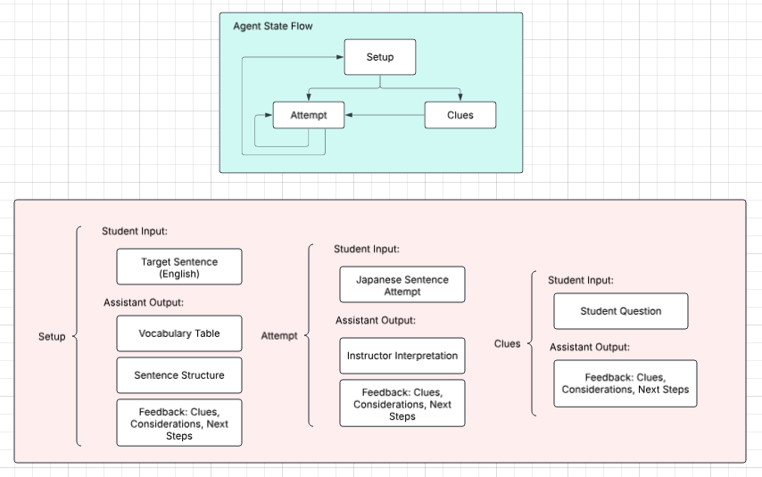

# Week 1 - Level 100 -Sentence Constructor

State Diagram:

### Meta AI

https://github.com/wfmonster/free-gen-ai-bootcamp-2025/tree/main/sentence-constructor/meta-ai

This is the original prompt given in the videos. I had a lot of difficulty with Meta AI. 
The tables would never show the japanese characters and it did not perform as well as other models and prompts.

### ChatGPT

https://github.com/wfmonster/free-gen-ai-bootcamp-2025/tree/main/sentence-constructor/chatgpt

This is the original prompt given in the videos. 
I only have the free version of ChatGPT currently

### Claude - Sonnet 3.5

https://github.com/wfmonster/free-gen-ai-bootcamp-2025/tree/main/sentence-constructor/claude

- Improved the given prompt by adding a more explicit structure and directing it to use inquiry based learning and the socratic method. I also gave the additional context provided in the videos. 
- I used more direct and concise language such as teacher and student and changed clues to feedback. and adjusted the state accordingly.
- This prompt performed much betterthan I anticipated and never truly gave the answer. 
- By providing an explicit structure for the vocab table it always provided the correct format. 
- I documented the prompt flow in `claude/documenting-prompt-flow.md`

### Claude Coach - Claude 3 Opus (Pro Plan)

https://github.com/wfmonster/free-gen-ai-bootcamp-2025/tree/main/sentence-constructor/claude-coach

I developed a new prompt that provides the user with a list of slash commands and attempts to use gamification to award the player for correct translations. This includes the following sections.  For this prompt I did not provide any additional context and it performed better than I anticipated, but had a few issues and it needs more testing and refinement.
- Persona 
- Context
- Slash Commands for different actions 
- XP points to reward the users progress. 
- Instructions for each mode 

Instead of using states it uses a set of commands to help the user have more control of the model state includeing,
- /help - a list of slash commands (this list)
- /vocab - provide the vocabulary table of all japanese words used in this conversation
- /learn - Enter learning Mode - Help the user translate an english sentence into japanese - as given below.
- /rank  - Display current level and XP points needed for th next level. 
- /structure - provide the sentence structure for the current sentence the student is working on. 
- /feedback - provide feedback in the form of hints, considerations, and next steps
- /esc - Exit all modes

I documented the prompt flow in `claude-coach/documenting-prompt-flow.md`

 
